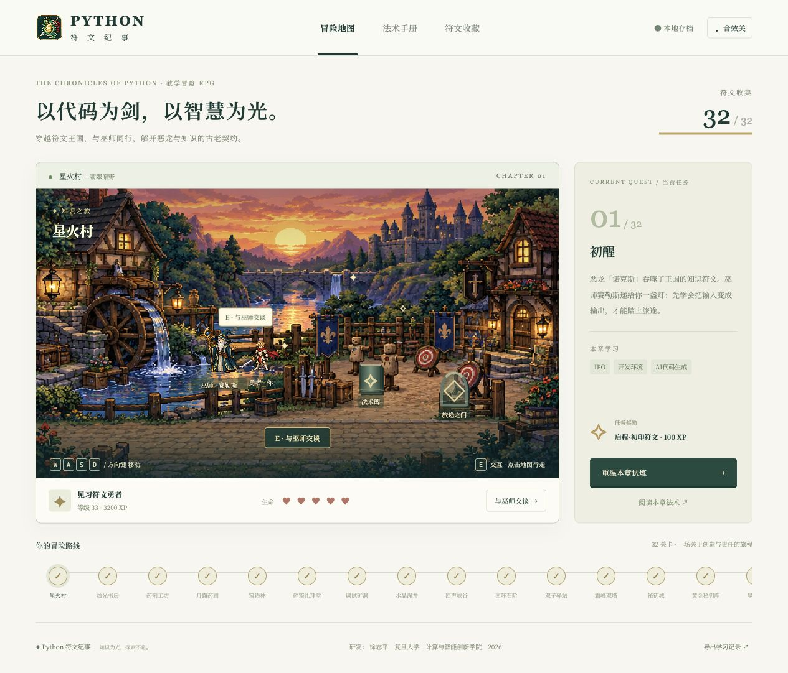

# Python 符文纪事 · Python Rune Quest

**把 Python 程序设计变成一段 32 关的像素冒险。**勇者与巫师赛勒斯追踪学徒艾琳的线索，在每关五道 Python 试炼中集齐符文，解开恶龙诺克斯的诅咒。

**研发：徐志平 · 复旦大学计算与智能创新学院 · 2026**  
[游戏官网与下载页面](https://bennix.github.io/PythonRPGGame/) · [全部版本与安装包](https://github.com/bennix/PythonRPGGame/releases/latest)



## 游戏特色

- 32 个关卡，各有专属像素场景和连续剧情；16 周课程各分基础、进阶两关。
- 160 道关卡专属选择题，逐题解析、错题重试、离开后续答。完成本关所有题目才解锁下一关。
- 勇者使用 WASD、方向键或点击行走；靠近巫师、法术碑和旅途之门时，柔和闪烁的光提示交互位置。
- 法术手册覆盖变量、流程控制、数据结构、函数、模块、文件、Pandas、HTTP API 和大模型；另有正则表达式概念、语法与交互练习台。
- 本地自动存档，可导出学习记录；赠予符文龙主题应用图标。

## 下载与安装

前往 [最新 Release](https://github.com/bennix/PythonRPGGame/releases/latest) 选择平台。

| 系统 | 安装包 |
| --- | --- |
| macOS Apple Silicon | 已签名、公证并装订票据的 DMG |
| Windows x64 | NSIS 安装程序 EXE |
| Ubuntu/Debian x64 | DEB 安装包 |
| Fedora/Red Hat/openSUSE x64 | RPM 安装包 |

macOS DMG 由项目研发者在 Apple Developer ID Application 身份下本机签名和公证。Windows、DEB、RPM 使用 GitHub Actions 对应平台原生构建。

## 开发

```sh
npm ci
npm start
```

热更新预览：`npm run dev`。打包脚本：`npm run dist:mac`、`npm run dist:win`、`npm run dist:linux`。网页版源码位于 `landing/`；GitHub Pages 部署工作流发布至 [项目网站](https://bennix.github.io/PythonRPGGame/)。

项目需要 Node.js 24 以上。Electron 打包目录 `release/` 与构建资源 `dist/` 均由脚本生成。

## 教学范围

题目用于练习概念，不替代大纲中的本机编程、报告、项目答辩或正式课程考核。当前示例不在游戏内执行 Python，也不联网调用 HTTP 服务或大模型 API。正则匹配台在浏览器 JavaScript 引擎中预览；Python 特有语法须在 Python `re` 模块验证。

## 许可

MIT License · 2026 徐志平
